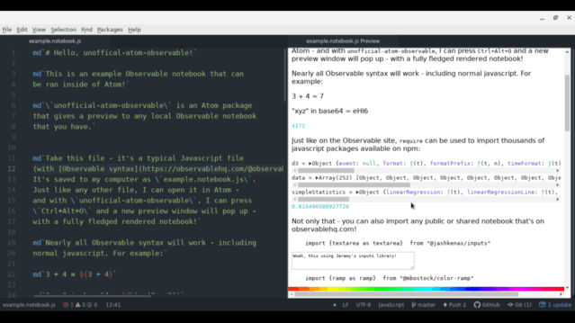

# atom-observable package

Render full Observable notebooks in Atom!



## Installing

[Package here](https://atom.io/packages/atom-observable). You can `apm install atom-observable` or just look up `atom-observable` in the Atom package installer.

## Usage

When you have a "notebook" file open, just press `Alt+Ctrl+O` (or `Packages` -> `atom-observable` -> `Toggle`), and a preview will popup, with the rendered component.

Once the preview is open, whenever you save the file, the entire preview will reload. It's not as cool of a dev experience as observablehq.com is, but it's something!

All [`stdlib`](https://github.com/observablehq/stdlib) should work - `DOM`, `require`, `html`, `md`, all that. `import` cells will resolve from observablehq.com by default.

### What is a "notebook"?

It's basically just a regular notebook you would write on observablehq.com, but in a file. It can be made of several top-level cell definitions - with import support!

For example:

```javascript

a = 1

b = 2

c = a + b

viewof name = DOM.input()

md`Hello ${name}!`

import {chart} from "@d3/bar-chart"
```

Keep in mind - not all javascript files are valid Observable syntax. [`example.notebook.js`](./example.notebook.js) is a pretty verbose example of what could work.

## How it works

Most of the magic happens with [`@alex.garcia/unofficial-observablehq-compiler`](https://github.com/asg017/unofficial-observablehq-compiler) - an unofficial compiler for Observable notebook syntax. All this package does is basically send the file contents to an iframe, and a script in the iframe uses the compiler to compile it to an element.

## Contributing

Please do! There's a ton of potential here - access to node.js, custom libraries, better local development. Take a look at these [issues](https://github.com/asg017/atom-observable/issues) to find something to work on. Just please follow the [Contributor Covenant](https://www.contributor-covenant.org/) in all your interactions 😄

## Acknowledgement

This was built with libraries like [@observablehq/runtime](https://github.com/observablehq/runtime) and [@observablehq/parser](https://github.com/observablehq/parser) which are licensed under ISC.
